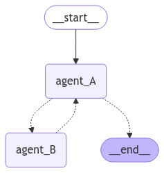

# multi_agent_project
Example of basic multi agent application in which we have 2 agents.

- the user interacts directly with agent A
- agent A answers user if he knows the answer otherwise it forwards it to agent B
- agent B provides an in depth explaination to agent A
- agent A forwards the answer to the user



# How to run it locally

```
git clone https://github.com/enomis-dev/multi_agent_project.git
```

## Virtual env

- create virtual env

```
python -m venv multi_agent
```

- activate venv

Windows
```
python -m venv multi_agent
```

macOS/Linux
```
source myenv/bin/activate
```

- install requirements
```
pip install -r requirements.txt
```

- set up OPENAI_API_KEY as env var

1. On Linux or macOS
If you are using bash or zsh:

- Temporary Setup (valid for the current terminal session):
export OPENAI_API_KEY="your-api-key-here"

- Permanent Setup (persists across sessions):
Open your shell configuration file:

For bash, edit ~/.bashrc or ~/.bash_profile.
For zsh, edit ~/.zshrc.

Add the following line:
export OPENAI_API_KEY="your-api-key-here"

Save the file and apply the changes:
source ~/.bashrc  # For bash
source ~/.zshrc   # For zsh


2. On Windows
Temporary Setup (valid for the current terminal session):
- In Command Prompt:
set OPENAI_API_KEY=your-api-key-here

- In PowerShell:
$env:OPENAI_API_KEY="your-api-key-here"

- Permanent Setup (System-wide):
Open the Environment Variables dialog:
Press Win + R, type sysdm.cpl, and hit Enter.
Go to the Advanced tab and click Environment Variables.
Under System variables or User variables, click New.

Add:

Variable name: OPENAI_API_KEY
Variable value: your-api-key-here


- run the application

```
cd src
python app.py
```

The app will show at http://127.0.0.1:5000


## Dockerfile

- build the docker image
```
docker build -t myapp .
```

- run the image
```
docker run -e OPENAI_API_KEY=your_openai_api_key -p 5000:5000 myapp
```
The app will show at http://127.0.0.1:5000
